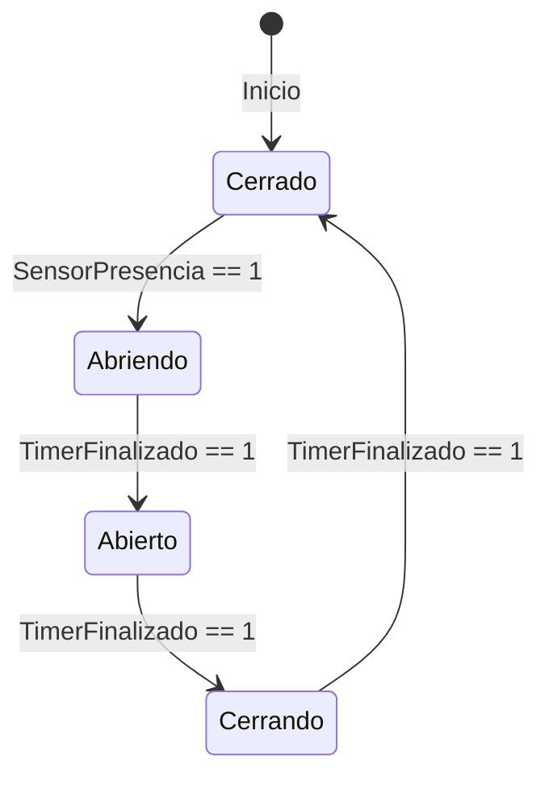
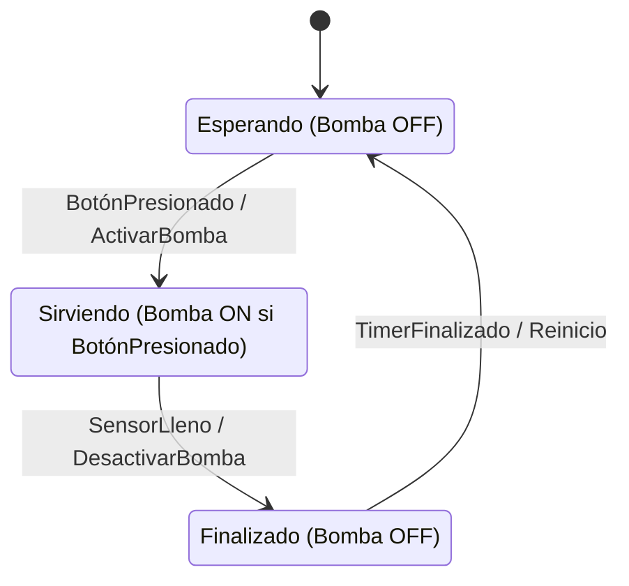
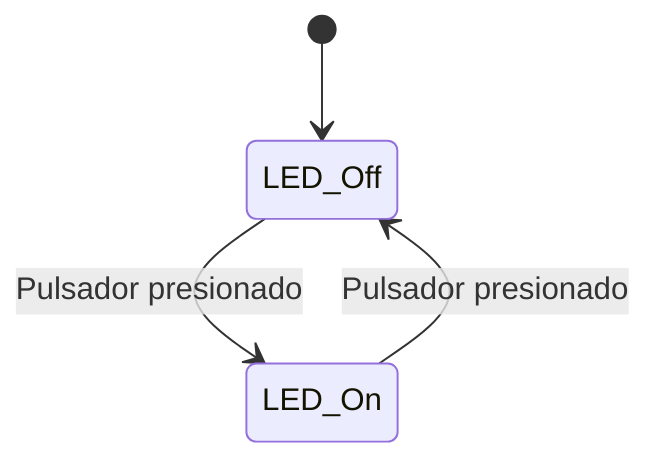

# Actividad 1: Máquinas de Estados Finitos

# Lectura 1: Modelado en sistemas embebidos

El modelado en sistemas embebidos se refiere a la creación de representaciones simplificadas de un sistema que capturan las propiedades esenciales desde un punto de vista específico. Esta práctica es fundamental y ha sido una actividad central para técnicos e ingenieros a lo largo de la historia de la ingeniería. Los modelos más útiles son aquellos que se caracterizan por su abstracción, permitiendo concentrarse en los aspectos más importantes del sistema y eliminar lo irrelevante; son comprensibles, lo que facilita su interpretación; precisos, reflejando fielmente el sistema que representan; predictivos, al permitir anticipar comportamientos futuros del sistema modelado; y económicos, ya que son más baratos de desarrollar y estudiar en comparación con el propio sistema real.

Los modelos empleados para desarrollar software en sistemas embebidos no solo permiten obtener un conocimiento más profundo del problema, sino que también son utilizados como base para la generación de código. Los enfoques modernos en el desarrollo de software basado en modelos se caracterizan por la utilización de representaciones gráficas que describen el sistema a desarrollar. Estas representaciones ofrecen un grado de abstracción que facilita la comprensión del sistema y permite, a partir del propio modelo, generar código ejecutable para el sistema embebido.

# Máquina de Estados Finitos (MFE)

Una máquina de estados finitos (MEF) es un modelo ampliamente utilizado para representar el comportamiento de sistemas electrónicos e informáticos. Se basa en la teoría de autómatas y se emplea para describir sistemas cuyo funcionamiento depende tanto de eventos actuales como de eventos pasados. Este modelo es fundamentalmente una herramienta gráfica que permite visualizar cómo un sistema cambia de estado en respuesta a diferentes entradas del entorno. En cualquier momento, la máquina se encuentra en un estado específico y, dependiendo de las entradas recibidas, puede cambiar o mantenerse en el mismo estado, realizando acciones que impactan en su entorno. Las máquinas de estados finitos son esenciales para modelar comportamientos secuenciales en sistemas embebidos y otros sistemas computacionales.

## Características relevantes

- El modelado de una MEF puede realizarse utilizando un "diagrama de estados" o una "tabla de estados".
- La máquina de estados cambia de estado según los "flags" o indicadores de estado.
- Existen reglas bien definidas que determinan cómo y cuándo cambiar de estado.
- Cada transición entre estados implica diferentes respuestas del sistema.
- Existen dos tipos principales de implementaciones de MEF:
    - **Moore**: Donde las salidas dependen únicamente del estado actual.
    - **Mealy**: Donde las salidas dependen tanto del estado actual como de las entradas.

### Diferencias y Similitudes entre Máquina de Moore y Máquina de Mealy

### Máquina de Moore

- **Definición:** En una máquina de Moore, la salida depende únicamente del estado actual del sistema.

### Ejemplo 1

**Máquina de Estados Finitos de Moore**, basado en un **controlador de puerta automática**. En este sistema:

- **Estados**: `Cerrado`, `Abriendo`, `Abierto`, `Cerrando`
- **Entradas**: `SensorPresencia`, `TimerFinalizado`
- **Salidas**: `Motor_ON`, `Motor_OFF`



### **Explicación del diagrama**

- Inicialmente, la puerta está en **Cerrado** y el motor está apagado (`Motor_OFF`).
- Cuando el **sensor de presencia detecta a alguien**, la FSM pasa a **Abriendo** y el motor se enciende (`Motor_ON`).
- Al finalizar el **temporizador**, la puerta se considera **Abierta** y el motor se apaga.
- Tras otro temporizador, la FSM cambia a **Cerrando**, encendiendo de nuevo el motor (`Motor_ON`).
- Finalmente, cuando el temporizador finaliza, la puerta regresa a **Cerrado** (`Motor_OFF`).

<aside>
🔥

Este es un **ejemplo clásico de Moore**, ya que las **salidas dependen solo del estado en el que se encuentra el sistema**, no de las entradas en tiempo real.

</aside>

- **Características:**
    - La salida se asocia directamente con el estado. Pueden existir múltiples estados con la misma salida, pero cada estado es diferente.
    - El siguiente estado depende de la entrada y del estado actual.
    - Generalmente, las salidas cambian solo en los límites de los ciclos del reloj.
    - Simplifica el diseño de sistemas donde las salidas deben ser estables y no deben cambiar rápidamente.
- **Ejemplo:** Un semáforo donde cada estado (verde, amarillo, rojo) determina directamente la luz que se enciende.

### Máquina de Mealy

- **Definición:** En una máquina de Mealy, la salida depende tanto del estado actual del sistema como de las entradas actuales.

### Ejemplo:

**Máquina de Estados Finitos de Mealy**, basado en un **dispensador automático de bebidas**. En este sistema:

- **Estados**: `Esperando`, `Sirviendo`, `Finalizado`
- **Entradas**: `BotónPresionado`, `SensorLleno`
- **Salidas**: `ActivarBomba`, `DesactivarBomba`
- **Diferencia clave con Moore**: La salida depende **tanto del estado como de la entrada**.



### **Explicación del diagrama**

1. **Estado `Esperando` (Bomba apagada)**
    - El sistema espera que el usuario presione el botón (`BotónPresionado == 1`).
    - **Si se presiona el botón**, se activa la bomba (`ActivarBomba`), **pero solo mientras el botón esté presionado** (característica de Mealy).
2. **Estado `Sirviendo` (Bomba encendida si el botón sigue presionado)**
    - La bomba sigue activada **solo si el botón sigue presionado** (esto hace que dependa de la entrada en tiempo real).
    - Cuando el **sensor detecta que el vaso está lleno (`SensorLleno == 1`)**, se apaga la bomba (`DesactivarBomba`).
3. **Estado `Finalizado` (Bomba apagada)**
    - Se espera un tiempo determinado (`TimerFinalizado == 1`).
    - Luego, se reinicia a `Esperando` para el siguiente cliente.

### **Diferencia con Moore** ✅

- En una FSM de **Moore**, la bomba se activaría en el estado **Sirviendo** sin importar si el botón sigue presionado.
- En **Mealy**, la bomba solo se activa **mientras el botón esté presionado**, lo que permite **una respuesta inmediata** a la entrada.

<aside>
🔥

Este es un ejemplo realista de cómo una **FSM de Mealy** puede usarse en sistemas embebidos para responder rápidamente a cambios en las entradas.

</aside>

- **Características:**
    - Las salidas pueden cambiar de inmediato en respuesta a cambios en las entradas.
    - El siguiente estado depende del estado actual y de las entradas.
    - Puede reaccionar más rápidamente a las entradas, ya que no espera un cambio de estado para cambiar las salidas.
    - Útil en aplicaciones donde la velocidad de respuesta es crucial.

### Visualización de las Diferencias

La siguiente figura esquematiza las diferencias entre los dos tipos de máquinas de estado analizadas aquí. 


- **Máquina de Moore:**
    
    ```
    Estado -> Salida
    ```
    
- **Máquina de Mealy:**
    
    ```
    Estado + Entrada -> Salida
    ```
    

## Tablas de Estados 📝

Las tablas de estados son muy útiles para representar de forma ordenada las transiciones. Por ejemplo:

| **Estado Actual** | **Entrada** | **Estado Siguiente** | **Salida** (Moore) |
| --- | --- | --- | --- |
| Verde | Temporizador fin | Amarillo | Verde ON, Resto OFF |
| Amarillo | Temporizador fin | Rojo | Amarillo ON, Resto OFF |
| Rojo | Temporizador fin | Verde | Rojo ON, Resto OFF |

> En una Máquina de Moore, la salida está asociada a cada estado: “Verde ON”, “Amarillo ON”, “Rojo ON”. Si fuera Mealy, la salida dependería además de la entrada actual.
> 

---

## Tablas de Transiciones 🔗

Otra forma de ver la misma información, pero enfatizando **en qué condiciones** cambias de estado:

| **Estado Actual** | **Condición** | **Estado Siguiente** |
| --- | --- | --- |
| A | `input == 1` | B |
| A | `input == 0` | A |
| B | `input == 1` | B |
| B | `input == 0` | A |

En este ejemplo “genérico” de una FSM, el sistema salta de `A` a `B` solo si la entrada es 1.

## Ejemplo 2

Analiza el siguiente ejemplo donde se crea una máquina de estados para modelizar el sistema control de un semáforo.


Se pueden establecer 4 estados:

1. Rojo
2. Rojo - Amarillo
3. Verde
4. Amarillo

Las entradas, en este caso, serán el tiempo transcurrido entre cada estado. 

Las salidas, por su parte, son el estado de encendido o apagado de las luces del semáforo.

A partir de este análisis, podemos modelizar el sistema de control a partir de una MEF. Observa el siguiente gráfico y analiza cómo funciona. 


Fuente: [Cómo Modelar Máquinas de Estados Finitos en Sistemas Embebidos](https://youtu.be/Rv41MKgknIg?si=cCfRC40ClJ2FKSyb)

## Ejemplo 3

### 1. Máquina: Sistema antirrebotes para pulsador

**Diagrama de estados :**


**Tabla de Transiciones:**

| Estado Actual | Evento / Condición | Estado Siguiente |
| --- | --- | --- |
| Espera | Pulsador ON | Debounce_Press |
| Debounce_Press | 30 ms y pulsador ON | Presionado |
| Debounce_Press | 30 ms y pulsador OFF | Espera |
| Presionado | 30 ms y pulsador OFF | Debounce_Release |
| Presionado | 30 ms y pulsador ON | Presionado |
| Debounce_Release | 30 ms y pulsador OFF | Espera |
| Debounce_Release | 30 ms y pulsador ON | Presionado |

**Explicación:**

La máquina comienza en el estado **Espera**. Al detectar la pulsación, transita a **Debounce_Press**, donde se activa el temporizador Systick para confirmar la estabilidad de la señal. Si, al vencerse el tiempo, el pulsador sigue activo, pasa al estado **Presionado,** si no, vuelve al estado **Espera**; al soltar el pulsador, entra en **Debounce_Release** y, tras estabilizarse, vuelve a **Espera**. En caso contrario, vuelve al estado **Presionado**.

**Pseudocódigo:**

```
estado ← ESPERA

mientras el sistema esté en funcionamiento hacer
    si estado es igual a ESPERA entonces
        si pulsador es igual a ACTIVADO entonces
            iniciar temporizador con duración de 30 milisegundos
            estado ← DEBOUNCE_PRESION
        fin si
    fin si

    si estado es igual a DEBOUNCE_PRESION entonces
        si han transcurrido 30 milisegundos entonces
            si pulsador es igual a ACTIVADO entonces
                estado ← PRESIONADO
            si no si pulsador es igual a DESACTIVADO entonces
                estado ← ESPERA
            fin si
        fin si
    fin si

    si estado es igual a PRESIONADO entonces
        si han transcurrido 30 milisegundos entonces
            si pulsador es igual a DESACTIVADO entonces
                iniciar temporizador con duración de 30 milisegundos
                estado ← DEBOUNCE_LIBERACION
            si no si pulsador es igual a ACTIVADO entonces
                estado ← PRESIONADO
            fin si
        fin si
    fin si

    si estado es igual a DEBOUNCE_LIBERACION entonces
        si han transcurrido 30 milisegundos entonces
            si pulsador es igual a DESACTIVADO entonces
                estado ← ESPERA
            si no si pulsador es igual a ACTIVADO entonces
                estado ← PRESIONADO
            fin si
        fin si
    fin si
fin mientras
```

## Ejemplo 4

### 2. Máquina: Encender/Apagar LED con pulsador

**Diagrama de estados:**



**Tabla de Transiciones:**

| Estado Actual | Evento | Estado Siguiente |
| --- | --- | --- |
| LED_Off | Pulsador presionado | LED_On |
| LED_On | Pulsador presionado | LED_Off |

**Explicación:**

La máquina arranca con el LED apagado (**LED_Off**). Cada vez que se presiona el pulsador, se alterna el estado: si está apagado, se enciende; si está encendido, se apaga.

**Pseudocódigo:**

```
estado ← LED_APAGADO

mientras el sistema esté en funcionamiento hacer
    si pulsador es igual a ACTIVADO entonces
        si estado es igual a LED_APAGADO entonces
            encender led
            estado ← LED_ENCENDIDO
        si no si estado es igual a LED_ENCENDIDO entonces
            apagar led
            estado ← LED_APAGADO
        fin si
    fin si
fin mientras
```

## Ejercicio 1

Ahora piensa cómo utilizarías los ejemplos anteriores para crear una MEF, que tenga como propósito manejar el pulsador (con la MEF para antirrebotes) y además, utilizar dicho pulsador, para encender y apagar el LED de la MEF 2.

---

## Ejercicio 2

Construye la tabla de transiciones para el siguiente problema. Luego realiza el gráfico de la máquina de estados que lo resuelve. 

## Problema:

Un tanque de agua abierto por la parte superior dispone de tres sensores de detección de llenado (A, B, C) que determinan 4 posibles niveles de llenado (VACÍO, NORMAL, LLENO, ALARMA). El  nivel del tanque se controla mediante dos válvulas (E, entrada y S, salida).
En condiciones de llenado normal, las válvulas E y S se encuentran abiertas.
Si el líquido llega al nivel de vacío, se  cierra la válvula de salida y se mantiene abierta la de entrada. Si el líquido llega al nivel de lleno, se cierra la válvula de entrada y se mantiene abierta la de salida. Si por cualquier circunstancia, por ejemplo lluvia, se llegara al nivel de alarma, se deberá cerrar la válvula de entrada y abrir la de salida. Esta situación se mantendrá hasta que el tanque llegue al estado de vacío.

### Datos adicionales:

El funcionamiento de los sensores digitales y las válvulas E y S se encuentra resumido en la siguiente imagen:


Fuente: [Link a la página del ejercicio](https://lonely113.blogspot.com/2011/03/ejemplos-maquina-de-estados.html)

---

## Ejercicio 3

### 1️⃣ **Sistema de Iluminación Inteligente 💡**

### **Descripción del Problema**

Se quiere implementar un sistema de iluminación en un cuarto que se active automáticamente con base en la presencia de una persona y la cantidad de luz en la habitación:

- Si el sensor de presencia detecta movimiento **y** el sensor de luz indica que la iluminación es baja, la lámpara debe encenderse.
- Si no hay movimiento después de **30 segundos**, la lámpara se apaga.
- Si el sensor de luz detecta suficiente iluminación natural, la lámpara no se enciende.
- Si una persona pulsa un interruptor manual, el sistema debe **anular** el sensor de presencia y permitir el control manual.

### **Requerimientos**

1. Representar la FSM mediante un **diagrama de estados**.
2. Determinar qué tipo de FSM es más adecuada para este problema (**Moore o Mealy**).
3. Plantear una **implementación en un microcontrolador**.

---

### 2️⃣ **Control de Motor con Variador de Velocidad 🔄**

### **Descripción del Problema**

Se necesita diseñar un sistema que controle la velocidad de un motor en función de la entrada de un usuario mediante botones de **Aumentar Velocidad** y **Disminuir Velocidad**. El sistema debe cumplir las siguientes condiciones:

- El motor tiene **tres velocidades**: **Baja**, **Media** y **Alta**.
- Si se presiona el botón de **Aumentar**, el sistema pasa al siguiente nivel de velocidad (hasta el límite de "Alta").
- Si se presiona el botón de **Disminuir**, la velocidad baja hasta llegar al estado de "Apagado".
- Si el botón de **Emergencia** es presionado en cualquier momento, el motor se detiene inmediatamente.

### **Requerimientos**

1. Diseñar el **diagrama de estados** de la FSM.
2. Construir la **tabla de estados y transiciones**.
3. Explicar cómo se implementaría en **Assembly o en C** para un microcontrolador.

---

### 3️⃣ **Sistema de Seguridad con Código Numérico 🔐**

### **Descripción del Problema**

Se debe diseñar una **cerradura electrónica** con un teclado matricial **4x4** que funcione de la siguiente manera:

- El usuario debe ingresar un código de **4 dígitos**.
- Si el código ingresado es correcto, la cerradura pasa al estado de **desbloqueo**.
- Si el código es incorrecto, se permite hasta **tres intentos** antes de bloquear el sistema por un tiempo determinado.
- La FSM debe incluir un estado de **espera**, **ingreso de dígitos**, **verificación** y **acción (desbloqueo o error)**.

### **Requerimientos**

1. Representar la FSM con un **diagrama de estados**.
2. Determinar la **tabla de transiciones**.
3. Plantear una forma de **implementar la FSM en hardware** (por ejemplo, en un microcontrolador o FPGA).

---

### 4️⃣ **Control de un Sistema de Riego Inteligente 🌱**

### **Descripción del Problema**

Se debe diseñar un **sistema de riego automático** basado en la humedad del suelo y un temporizador. El sistema debe cumplir las siguientes condiciones:

- Si la humedad del suelo es baja, el riego se activa.
- Una vez activado, debe permanecer encendido por **5 minutos** o hasta que el sensor de humedad indique un nivel adecuado.
- Si llueve (detectado por un sensor de lluvia), el sistema de riego debe detenerse inmediatamente.
- Debe haber un modo manual en el cual un usuario puede **forzar el riego**.

### **Requerimientos**

1. Diseñar el **diagrama de estados** de la FSM.
2. Construir la **tabla de estados y transiciones**.
3. Determinar si el diseño es mejor con una FSM de **Moore o Mealy**.

---